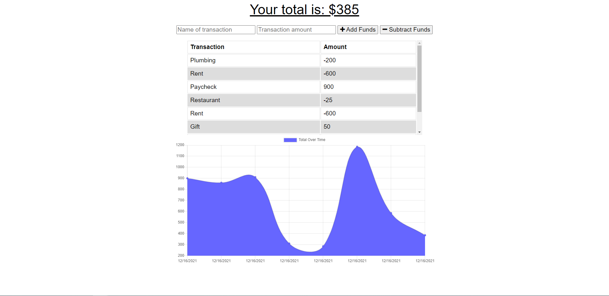

# Budget Tracker

## Description
A budget tracker PWA for users to track their withdrawals and deposits with or without an internet connection in order to maintain an accurate account balance while traveling.

## Table of Contents
* [Link](#link)
* [Installation](#installation)
* [Usage](#usage)
* [Offline Functionality](#offline-functionality)
* [License](#license)
* [Questions](#questions)

## Link
[Click here](https://my-budget-tracker101.herokuapp.com/) to go to the deployed application.

## Installation
To install the app on your machine for development:

1. Install [Node.js](https://nodejs.org/en/) and [MongoDB](https://www.mongodb.com/) if you haven't already.
2. Clone this repository onto your computer.
3. Navigate to the root of this repository on the command line.
4. Run `npm install` on the command line.

## Usage
1. Go to the deployed application at [https://my-budget-tracker101.herokuapp.com/](https://my-budget-tracker101.herokuapp.com/).
2. Enter a name for the transaction.
3. Enter an amount for the transaction.
4. Click 'Add Funds' to deposit or 'Subtract Funds' to withdraw.

## Offline Functionality
This PWA has full functionality with or without an internet connection.

If there is no internet connection, users can still enter transactions and have the data persist with IndexedDB. An IndexedDB database called 'budget_tracker' is created to store any offline data. Once a connection is re-established, the offline data is sent to the server and MongoDB database.

A service worker is also utilized to cache the application's files for use offline.

## License
Licensed under the [MIT](https://choosealicense.com/licenses/mit/) license.

## Questions
- [GitHub](https://github.com/kg-phantom)